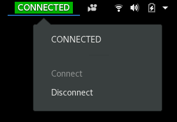

# GlobalProtectVPN

A Gnome extension that shows the GlobalProtect status in the top bar, features a menu showing the current status and a button to Connect / Disconnect, in addition to other functionality.

## What it does
When disconnected, the top bar will show a red button reading `UNPROTECTED`--as a reminder that there is no connection to the VPN. When connecting or disconnecting the button turns amber, and once connected it will turn green. Clicking the button will show the full command-line output of the status command in the menu. Undearneath the status is a button to connect / disconnect.

FIXME When updates are available a message will display in the menu.

### How it's different
This extension is a fork of a long lineage of extensions (gNordVPN-Local, NordVPN-Local, Quadipedia's NordVPN Status)
Kudos to them for creating the original.

## How to Install
This extension uses the `globalprotect` command line client.

### Install the extension
Easiest way:
enable on gnome-extensions at [GlobalProtectVPN Local on gnome extensions](https://extensions.gnome.org/extension/.../.../)

Manual install:  
1. Create a folder for the extension with `mkdir ~/.local/share/gnome-shell/extensions/globalprotectvpn@guyou`
2. Copy the files from this repo into that folder
3. Enable the extension using `Tweaks` (if you don't have it, install via `sudo apt install gnome-tweaks`)

## Development

Contributions welcome! If you find any issues or think of any cool features, check it's not already been raised under Issues and raise it.
